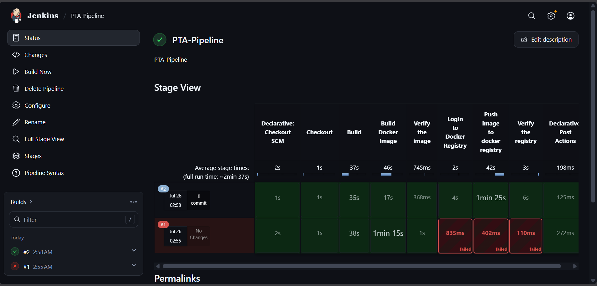
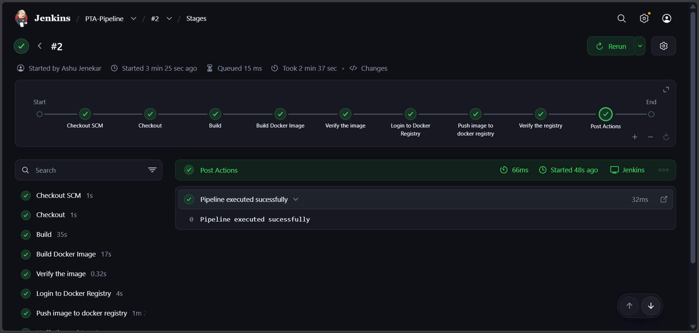
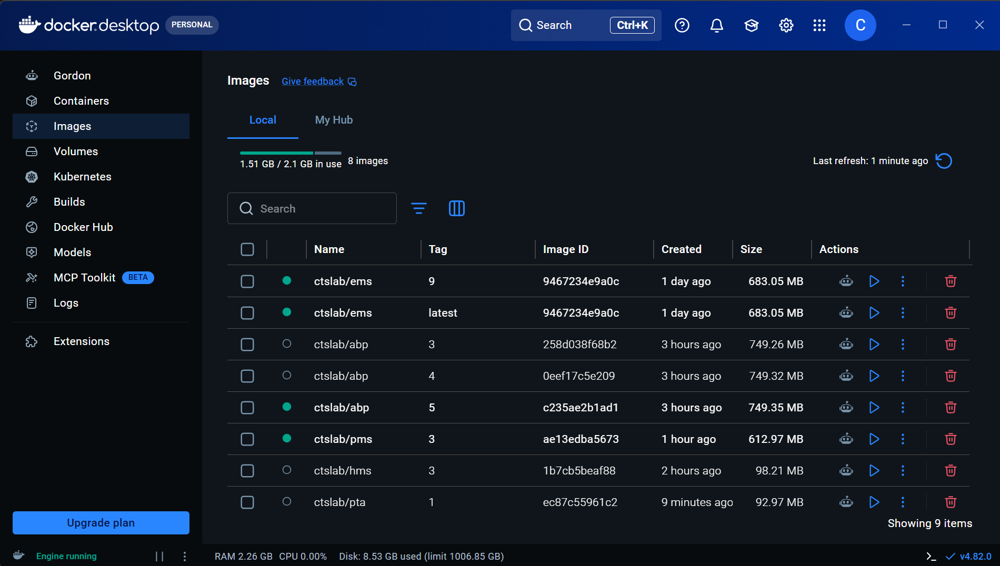
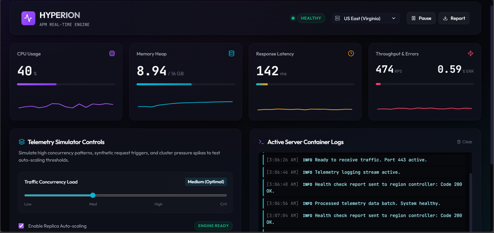

# 🚀 Performance Tracker App (PTA)

[](#cicd-pipeline-jenkins)
[](https://react.dev/)
[](https://www.typescriptlang.org/)
[](https://vitejs.dev/)
[](https://www.docker.com/)
[](https://kubernetes.io/)

**Performance Tracker App (PTA)** is a modern, high-performance Application Performance Monitoring (APM) dashboard designed to simulate and track system metrics (CPU, Memory, Latency, RPS) across multi-region server nodes in real time. Built with React 19, TypeScript, and Vite, it is fully containerized with Docker and ready for deployment on Kubernetes.

---

## 📋 Table of Contents

- [Features](#-features)
- [Tech Stack](#-tech-stack)
- [Local Development Setup](#-local-development-setup)
- [Building & Testing with Docker](#-building--testing-with-docker)
- [Publishing to Docker Registry](#-publishing-to-docker-registry)
- [Deploying to Kubernetes (K8s)](#-deploying-to-kubernetes-k8s)
- [CI/CD Pipeline (Jenkins)](#-cicd-pipeline-jenkins)
- [Project Structure](#-project-structure)

---

## ✨ Features

- ⚡ **Real-time Telemetry:** Dynamic simulation of CPU usage, RAM utilization, latency spikes, and requests per second (RPS).
- 🌍 **Multi-Region Node Selection:** Monitor nodes across US East, US West, EU Central, and Asia Pacific regions.
- 🎛️ **Load Simulation & Autoscaling:** Interactive controls for low, medium, high, and critical load testing with simulated autoscaling.
- 📜 **Live Logs Console:** Real-time log streamer with log level filtering (Info, Warning, Error) and export options.
- 🐳 **Production Optimized Container:** Multi-stage Docker build producing a lightweight Alpine-Nginx runtime static bundle.

---

## 🛠️ Tech Stack

- **Frontend:** React 19, TypeScript, Vite, Lucide React (Icons), Custom CSS3
- **Web Server:** Nginx (Alpine Linux)
- **Containerization:** Docker
- **Orchestration:** Kubernetes (K8s)
- **CI/CD:** Jenkins (`Jenkinsfile`)

---

## 💻 Local Development Setup

### Prerequisites

- [Node.js](https://nodejs.org/) v20 or higher
- [npm](https://www.npmjs.com/) v10 or higher

### Steps

1. **Clone the repository:**
   ```bash
   git clone https://github.com/progamerzx/Performance-Tracker-App.git
   cd Performance-Tracker-App
   ```

2. **Install dependencies:**
   ```bash
   npm install
   ```

3. **Run development server:**
   ```bash
   npm run dev
   ```
   Open `http://localhost:5173` in your browser.

4. **Lint and Type Check:**
   ```bash
   npm run lint
   npm run build
   ```

---

## 🐳 Building & Testing with Docker

The project utilizes a multi-stage Docker build:
- **Stage 1 (Build):** Compiles TypeScript and Vite static bundle using Node.js 20 Alpine.
- **Stage 2 (Production):** Serves static files using lightweight Nginx Alpine.

### Build Local Docker Image

```bash
docker build -t performance-tracker-app:latest .
```

### Run Docker Container Locally

```bash
docker run -d -p 8080:80 --name pta-container performance-tracker-app:latest
```

Access the application at `http://localhost:8080`.

---

## 📤 Publishing to Docker Registry

To make the image accessible for Kubernetes deployment, push it to a container registry like Docker Hub or GitHub Container Registry (GHCR).

### 1. Authenticate with Docker Registry

```bash
docker login -u <DOCKER_USERNAME>
```
*(Enter your password or Personal Access Token when prompted)*

### 2. Tag the Docker Image

Replace `<DOCKER_USERNAME>` with your Docker Hub username or registry path (e.g., `ctslab/pta`):

```bash
docker tag performance-tracker-app:latest <DOCKER_USERNAME>/pta:1.0.0
docker tag performance-tracker-app:latest <DOCKER_USERNAME>/pta:latest
```

### 3. Push to Docker Registry

```bash
docker push <DOCKER_USERNAME>/pta:1.0.0
docker push <DOCKER_USERNAME>/pta:latest
```

---

## ☸️ Deploying to Kubernetes (K8s)

Once your image is published to a Docker registry, you can pull and deploy it to any Kubernetes cluster (Minikube, EKS, GKE, AKS, or K3s).

### 1. Verify Docker Image Pulling (Optional)

You can verify the published image can be pulled:

```bash
docker pull <DOCKER_USERNAME>/pta:1.0.0
```

### 2. Create Kubernetes Manifest (`k8s-deployment.yaml`)

Create a file named `k8s-deployment.yaml` with the following content:

```yaml
apiVersion: apps/v1
kind: Deployment
metadata:
  name: pta-deployment
  labels:
    app: performance-tracker
spec:
  replicas: 3
  selector:
    matchLabels:
      app: performance-tracker
  template:
    metadata:
      labels:
        app: performance-tracker
    spec:
      containers:
      - name: pta-app
        image: <DOCKER_USERNAME>/pta:1.0.0 # Replace with your pushed image registry path
        imagePullPolicy: Always
        ports:
        - containerPort: 80
        resources:
          requests:
            cpu: "50m"
            memory: "64Mi"
          limits:
            cpu: "200m"
            memory: "128Mi"
---
apiVersion: v1
kind: Service
metadata:
  name: pta-service
spec:
  type: NodePort # Use LoadBalancer for cloud providers (AWS EKS / GCP GKE)
  selector:
    app: performance-tracker
  ports:
    - port: 80
      targetPort: 80
      nodePort: 30080
```

### 3. Apply to Kubernetes Cluster

```bash
# Apply deployment and service
kubectl apply -f k8s-deployment.yaml

# Check rollout status
kubectl rollout status deployment/pta-deployment

# Verify pods are running
kubectl get pods -l app=performance-tracker

# Verify service details
kubectl get svc pta-service
```

### 4. Access the Application

- **Minikube:**
  ```bash
  minikube service pta-service
  ```
- **Standard Cluster (NodePort):** Access via `http://<NODE_IP>:30080`
- **Cloud Cluster (LoadBalancer):** Obtain external IP via `kubectl get svc pta-service`.

---

## 🔄 CI/CD Pipeline (Jenkins)

The project includes an automated Jenkins pipeline defined in [`Jenkinsfile`](Jenkinsfile).

### Pipeline Stages:
1. **Checkout:** Clones the code from Git repository.
2. **Build:** Runs `npm ci`, `npm run lint`, and `npm run build`.
3. **Build Docker Image:** Packages application into Docker image tagged with `${BUILD_ID}`.
4. **Verify Image:** Inspects local built image metadata.
5. **Login to Docker Registry:** Securely logs into Docker Hub using stored Jenkins credentials (`dockerhub-creds`).
6. **Push Image:** Pushes container image to Docker Hub repository (`ctslab/pta:${BUILD_ID}`).
7. **Verify Registry:** Pulls the image back to ensure integrity and logs out.

---

## 📁 Project Structure

```
Performance-Tracker-App/
├── .dockerignore
├── Dockerfile             # Multi-stage Docker build specification
├── Jenkinsfile            # Jenkins CI/CD pipeline automation
├── nginx.conf             # Nginx server configuration for SPA routing
├── package.json           # Dependencies and scripts
├── public/                # Static assets
├── src/
│   ├── App.tsx            # Main APM Dashboard Component
│   ├── App.css            # Component styles
│   ├── index.css          # Design system & utilities
│   └── main.tsx           # React entry point
└── vite.config.ts         # Vite build configuration
```





---

## 📄 License

This project is licensed under the MIT License.
